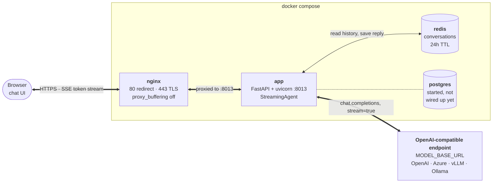

# Chatbot Template
Template repository for chatbot applications

## Features
- **Streaming Responses**: Tokens are streamed to the browser as server-sent events, so answers appear as they are generated
- **Any OpenAI-Compatible Model**: Point `MODEL_BASE_URL` at OpenAI, Azure, vLLM, Ollama, LiteLLM or anything else speaking the same API
- **Configurable Agent**: A single agent driven by the `SYSTEM_PROMPT` setting, no framework in between
- **Conversation History**: Chats are stored per user in Redis with a 24h TTL, so a conversation can be resumed or deleted
- **Built-in Chat UI**: Dark web interface served by the app itself, with markdown rendering, code highlighting and a conversation sidebar
- **RESTful API**: Clean FastAPI endpoints for integration
- **HTTPS Out of the Box**: nginx reverse proxy that self-signs a certificate on first start, with a Let's Encrypt flow for production
- **Docker Deployment**: Complete containerized setup

## Dependencies
- Docker & Docker Compose
- API key for an OpenAI-compatible endpoint (OpenAI by default)

## Architecture



| Endpoint | Purpose |
| --- | --- |
| `GET /` | Serves the chat UI |
| `POST /conversations/query` | Sends a message, streams the answer back as SSE |
| `GET /conversations/{email}` | Lists that user's conversations |
| `GET /conversations/{email}/{conversation_id}` | Loads one conversation with its messages |
| `DELETE /conversations/{email}/{conversation_id}` | Deletes a conversation |

## Quick Start

### 1. Clone and Setup
```bash
git clone git@github.com:MrLaki5/Chatbot-template.git
cd chatbot-template
```

### 2. Pre-commit Setup
Once installed, pre-commit will automatically run on every `git commit`. If any hooks fail, the commit will be rejected and you'll need to fix the issues before committing again.
```bash
pip install pre-commit
pre-commit install
```

### 2. Environment Configuration
Create a `.env` file with your API keys:
```env
MODEL_API_KEY=your_OPENAI_API_KEY_here
```

### 3. Start Services
```bash
docker compose up -d --build
```
