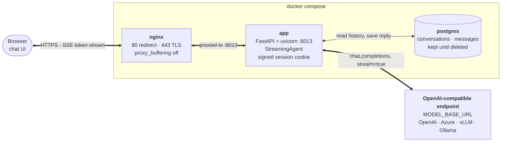

# Chatbot Template
Template repository for chatbot applications

## Features
- **Streaming Responses**: Tokens are streamed to the browser as server-sent events, following the [AI SDK Data Stream Protocol](https://ai-sdk.dev/docs/ai-sdk-ui/stream-protocol#data-stream-protocol), so any Vercel AI SDK client can consume it as-is
- **Any OpenAI-Compatible Model**: Point `MODEL_BASE_URL` at OpenAI, Azure, vLLM, Ollama, LiteLLM or anything else speaking the same API
- **Configurable Agent**: A single agent driven by the `SYSTEM_PROMPT` setting, no framework in between
- **Email Sessions**: The UI asks for an email on first visit and keeps it in a signed, `HttpOnly` session cookie; every endpoint reads the caller's address from the session rather than the URL or request body
- **Conversation History**: Chats are stored per user in Postgres and kept until deleted, so a conversation can be resumed after a restart
- **Schema Migrations**: The database schema is versioned with Alembic and brought up to date on every start
- **Built-in Chat UI**: Dark web interface served by the app itself, with markdown rendering, code highlighting and a conversation sidebar
- **RESTful API**: Clean FastAPI endpoints for integration
- **HTTPS Out of the Box**: nginx reverse proxy that self-signs a certificate on first start, with a Let's Encrypt flow for production
- **Docker Deployment**: Complete containerized setup

## Dependencies
- Docker & Docker Compose
- API key for an OpenAI-compatible endpoint (OpenAI by default)

## Architecture



| Endpoint | Purpose |
| --- | --- |
| `GET /` | Serves the chat UI |
| `POST /session` | Starts a session from an email and sets the session cookie |
| `GET /session` | Returns the session's email, `401` if there is none |
| `DELETE /session` | Clears the session |
| `POST /conversations/query` | Sends a message, streams the answer back as SSE |
| `GET /conversations` | Lists the session user's conversations |
| `GET /conversations/{conversation_id}` | Loads one conversation with its messages |
| `DELETE /conversations/{conversation_id}` | Deletes a conversation |

Everything under `/conversations` requires a session and answers `401` without one.

### Streaming Protocol

`POST /conversations/query` implements the
[AI SDK Data Stream Protocol](https://ai-sdk.dev/docs/ai-sdk-ui/stream-protocol#data-stream-protocol)
(`x-vercel-ai-ui-message-stream: v1`), so the bundled UI can be swapped for a Vercel AI SDK
frontend such as `useChat` without touching the backend. One turn looks like this:

```text
data: {"type":"start","messageId":"..."}
data: {"type":"start-step"}
data: {"type":"data-conversation","data":{"conversationId":"..."}}
data: {"type":"data-agent","data":{"agent":"Assistant","textId":"text_..."}}
data: {"type":"text-start","id":"text_..."}
data: {"type":"text-delta","id":"text_...","delta":"Hello"}
data: {"type":"text-end","id":"text_..."}
data: {"type":"finish-step"}
data: {"type":"finish"}
data: [DONE]
```

`data-conversation` and `data-agent` are custom `data-*` parts of the protocol: the first hands
back the conversation id to send with the next request, the second names the agent that is
answering. If the model fails part way through, the open text part is closed and an
`{"type":"error","errorText":"..."}` part is sent, and the stream still terminates with `[DONE]`.

## Quick Start

### 1. Clone and Setup
```bash
git clone git@github.com:MrLaki5/Chatbot-template.git
cd chatbot-template
```

### 2. Pre-commit Setup
Once installed, pre-commit will automatically run on every `git commit`. If any hooks fail, the commit will be rejected and you'll need to fix the issues before committing again.
```bash
pip install pre-commit
pre-commit install
```

### 3. Environment Configuration
Create a `.env` file with your API keys:
```env
MODEL_API_KEY=your_OPENAI_API_KEY_here
```

### 4. Start Services
```bash
docker compose up -d --build
```
Website accessible at [https://localhost](https://localhost)

### 5. (Optional) Reset the database
Downgrades every migration and upgrades back to the latest, which leaves the tables in place
and empty. Every stored conversation is lost.
```bash
docker exec cb_template_app python scripts/init_db.py
```

### 6. (In deployment) Set SSL certificate
By default (`PROD=false`) nginx serves a self-signed certificate it generates on first
start. In deployment, `PROD=true` makes it request a Let's Encrypt certificate instead,
on start, without anything having to be run inside the container.

* When domain has been acquired, replace the `example.com` domain inside the following files with the acquired domain:
    * [Lets Encrypt certificate generation](nginx/letsencrypt_cert_gen.sh) (also holds the contact email)
    * [Nginx configuration](nginx/nginx_letsencrypt.conf)
* Point the domain's DNS record at the host and make sure ports 80 and 443 are reachable, otherwise the challenge cannot be answered
* Start the stack with `PROD` set, by adding `PROD=true` in `.env` file.

## Database Migrations
The schema is managed with [Alembic](https://alembic.sqlalchemy.org/), from
[app/src/alembic](app/src/alembic). The app runs `alembic upgrade head` on every start, so
`docker compose up -d --build` is all it takes to apply new migrations. Alembic reads the
database URL from `DATABASE_URL` in [config.py](app/src/config.py), the same one the app uses.

To change the schema, edit [models.py](app/src/orm/models.py) and generate a revision from it.
The source folder is mounted so the new file lands in the repository, owned by you rather
than by root:
```bash
docker compose run --rm --user "$(id -u):$(id -g)" -v ./app/src:/app/src app \
    alembic revision --autogenerate -m "add users table"
```
Read the generated file in [app/src/alembic/versions](app/src/alembic/versions) before
committing it, because autogenerate cannot detect everything (a renamed column shows up as a
drop and an add, for example). Then rebuild with `docker compose up -d --build`.

Other useful commands:
```bash
docker exec cb_template_app alembic current      # revision the database is at
docker exec cb_template_app alembic history      # every revision, newest first
docker exec cb_template_app alembic downgrade -1 # undo the latest migration
```

### Squashing Revisions
Once revisions pile up, they can be replaced by a single one that creates the whole schema.
Every existing database must have all the old revisions applied before this, so deploy the
last version before the squash first.
```bash
# 1. Delete the old revisions, git keeps their history
rm -f app/src/alembic/versions/*.py

# 2. Generate one revision holding the whole schema, by comparing the models to an empty database
docker exec cb_template_db psql -U postgres -c "CREATE DATABASE squash"
docker compose run --rm --user "$(id -u):$(id -g)" -v ./app/src:/app/src \
    -e DATABASE_URL=postgresql+asyncpg://postgres:postgres@db:5432/squash \
    app alembic revision --autogenerate -m "initial schema"
docker exec cb_template_db psql -U postgres -c "DROP DATABASE squash"

# 3. Existing databases already have the tables, so only record the new revision in them
docker compose build app
docker compose run --rm app alembic stamp --purge head
docker compose up -d
```
Autogenerate only knows what is in the models. Anything the old revisions did in raw SQL
through `op.execute` (extensions, triggers, functions, seed data) has to be copied into the
new revision by hand.

Step 3 runs once on every existing database, locally and in each deployment, before the app
starts on the new code. Until then the app fails on start with `Can't locate revision`,
because the database still points at a revision that no longer exists. New databases need
nothing, they just run the new revision.

## References
- [AI SDK Data Stream Protocol](https://ai-sdk.dev/docs/ai-sdk-ui/stream-protocol#data-stream-protocol) - the wire format `/conversations/query` follows
- [OpenAI Chat Completions API](https://platform.openai.com/docs/api-reference/chat) - the model API the agent speaks
